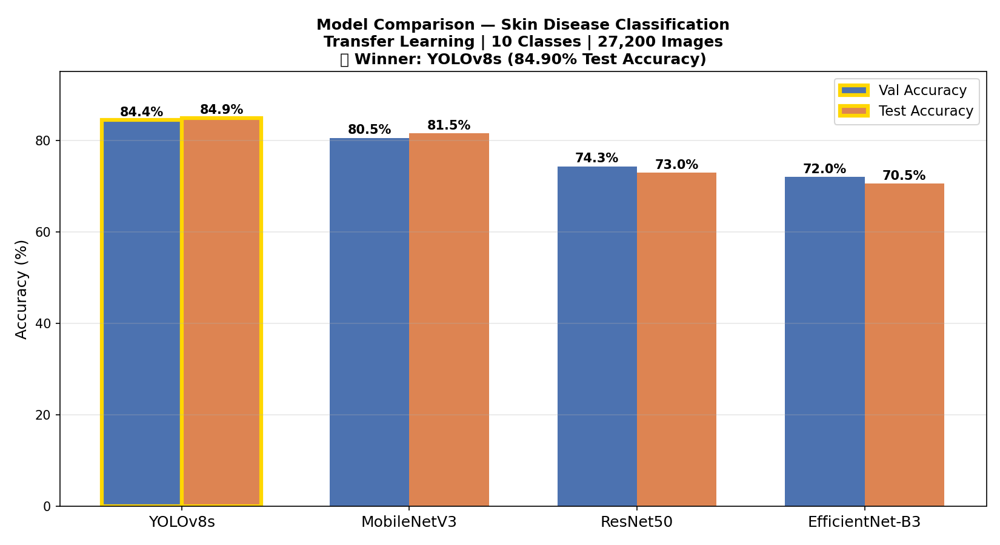
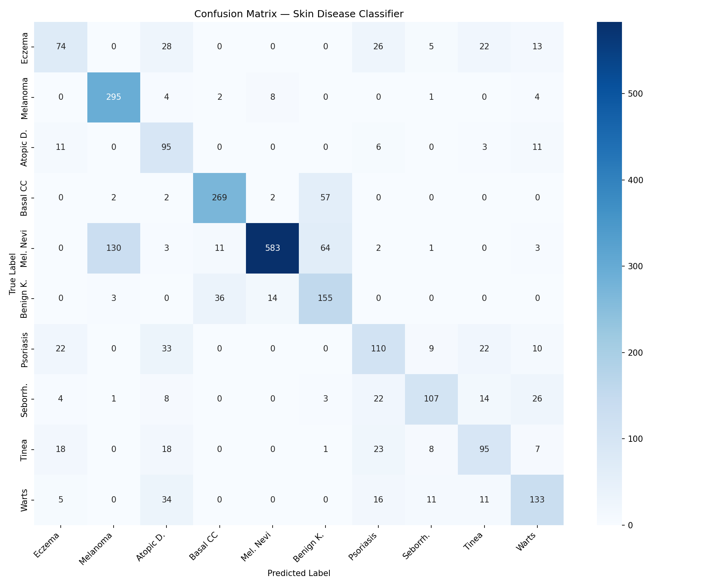

# Skin Disease Detection & AI Advisor

## Overview

An AI-powered system that classifies skin conditions from uploaded images and provides personalised medical guidance. The system uses a **YOLOv8s** model trained on around 27,200 (27,153) skin images across 10 disease classes, then passes results to **Google Gemini 2.5 Flash** to generate actionable recommendations, next steps, and daily care tips.

---

## Features

- YOLOv8s skin disease classification — **84.90% test accuracy**
- Gemini 2.5 Flash LLM recommendations with offline fallback
- FastAPI REST API with automatic Swagger docs
- Gradio web interface for easy image upload and results
- SQLite database logging of all analyses
- Fully Dockerised deployment

---

## Model Performance

Four transfer learning models were trained and compared on the Kaggle Skin Disease Dataset:

| Model                  | Val Accuracy | Test Accuracy |
| ---------------------- | ------------ | ------------- |
| **YOLOv8s (Selected)** | **84.41%**   | **84.90%**    |
| MobileNetV3            | 80.54%       | 81.55%        |
| ResNet50               | 74.31%       | 72.97%        |
| EfficientNet-B3        | 71.99%       | 70.54%        |

YOLOv8s was selected for its superior accuracy and fast inference speed, making it ideal for real-time classification. Model training was performed on **Google Colab** (GPU) and the trained weights (`best.pt`) are loaded at runtime.





---

## Supported Conditions (10 Classes)

| #   | Condition                                  |
| --- | ------------------------------------------ |
| 1   | Eczema                                     |
| 2   | Melanoma                                   |
| 3   | Atopic Dermatitis                          |
| 4   | Basal Cell Carcinoma                       |
| 5   | Melanocytic Nevi                           |
| 6   | Benign Keratosis-like Lesions              |
| 7   | Psoriasis                                  |
| 8   | Seborrheic Keratoses                       |
| 9   | Tinea Ringworm Candidiasis                 |
| 10  | Warts Molluscum and other Viral Infections |

---

## Tech Stack

| Component  | Technology              |
| ---------- | ----------------------- |
| Backend    | Python, FastAPI         |
| ML Model   | YOLOv8s (Ultralytics)   |
| LLM        | Google Gemini 2.5 Flash |
| Frontend   | Gradio                  |
| Database   | SQLite (via SQLAlchemy) |
| Deployment | Docker                  |

---

## Project Structure

```
skin-disease-advisor/
├── app/
│   ├── main.py              # FastAPI app entry point
│   ├── classifier.py        # YOLOv8 image classification
│   ├── llm.py               # Gemini LLM recommendations
│   ├── database.py          # SQLite logging
│   └── schemas.py           # Pydantic request/response models
├── ui/
│   └── app.py               # Gradio web interface
├── docker/
│   ├── Dockerfile
│   └── docker-compose.yml
├── assets/
│   ├── model_comparison.png
│   └── confusion_matrix.png
├── checkpoints/
├── requirements.txt
└── .env
```

---

## Local Setup

### 1. Clone the repository

```bash
git clone <repo-url>
cd skin-disease-advisor
```

### 2. Install dependencies

```bash
pip install -r requirements.txt
```

### 3. Configure environment

Create a `.env` file in the project root:

```
GEMINI_API_KEY=your_gemini_api_key_here
MODEL_PATH=checkpoints/best.pt
```

Get a free Gemini API key at [Google AI Studio](https://aistudio.google.com/).

### 4. Add the trained model

I have added trained YOLOv8 here.

### 5. Run the API

```bash
uvicorn app.main:app --reload
```

### 6. Run the Gradio UI (separate terminal)

```bash
python ui/app.py
```

- API: http://localhost:8000
- API Docs: http://localhost:8000/docs
- UI: http://localhost:7860

---

## Docker Deployment

```bash
docker compose -f docker/docker-compose.yml up --build
```

This starts two containers:

- `api` — FastAPI backend on port `8000`
- `ui` — Gradio frontend on port `7860`

---

## API Reference

### `POST /analyze_skin`

Classify a skin image and receive LLM-powered recommendations.

**Request:** `multipart/form-data`

| Field | Type | Description                  |
| ----- | ---- | ---------------------------- |
| image | file | JPEG or PNG image, max 10 MB |

**Response:**

```json
{
  "disease": "Eczema",
  "confidence": 0.92,
  "recommendations": "Keep skin moisturized and avoid known triggers...",
  "next_steps": "Book a routine dermatologist appointment within 2–4 weeks...",
  "tips": "Apply moisturizer right after bathing. Avoid hot showers...",
  "disclaimer": "This is not medical advice. Please consult a qualified dermatologist."
}
```

---

### `GET /health`

Check API and model status.

**Response:**

```json
{
  "status": "ok",
  "model_loaded": true,
  "version": "1.0.0"
}
```

---

### cURL Example

```bash
curl -X POST http://localhost:8000/analyze_skin \
  -F "image=@skin_photo.jpg"
```

Interactive API docs are available at **http://localhost:8000/docs**.

---

## Pipeline Architecture

```
Image Upload
     │
     ▼
Image Preprocessing (resize, normalise)
     │
     ▼
YOLOv8s Classification
     │
     ▼
disease + confidence score
     │
     ▼
Gemini 2.5 Flash LLM (prompt-based)
     │
     ▼
recommendations + next_steps + tips
     │
     ▼
JSON Response + SQLite log
```
